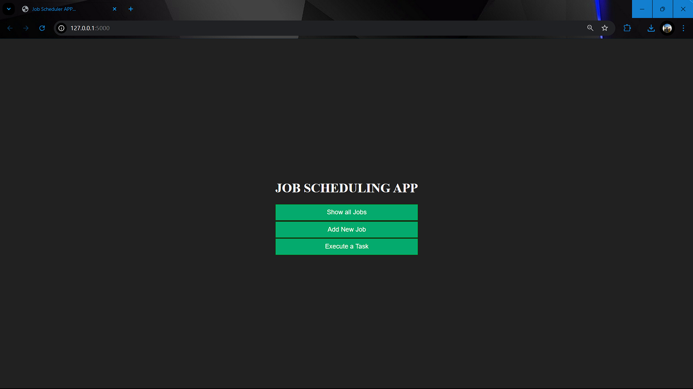
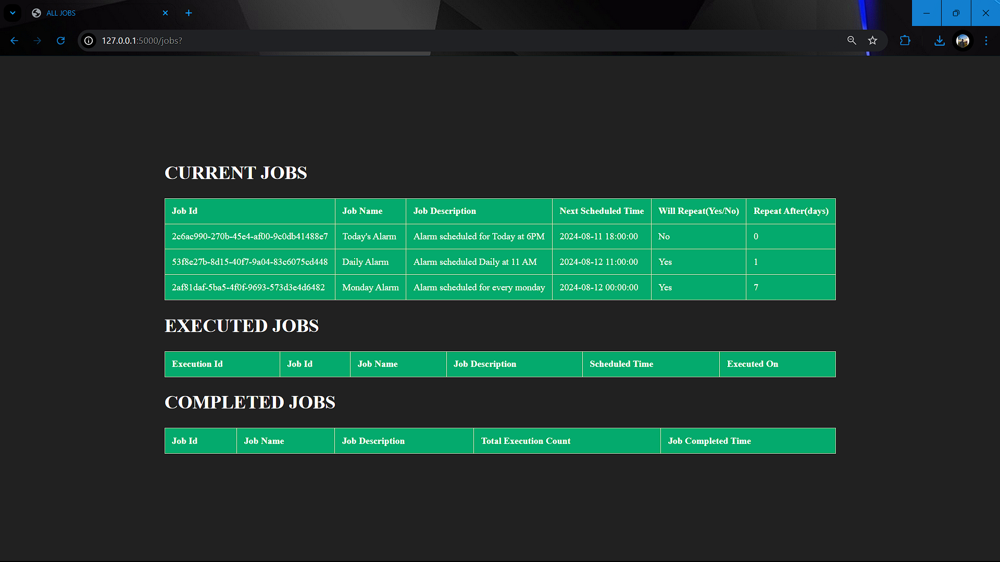
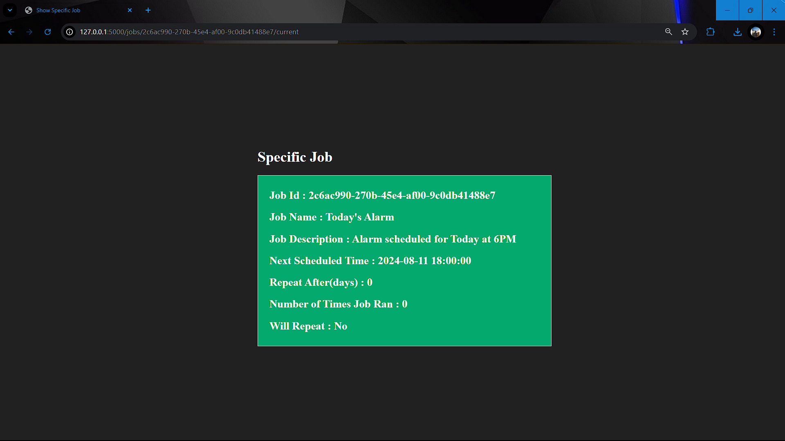
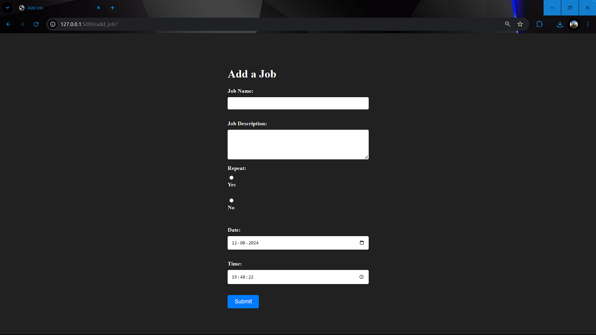
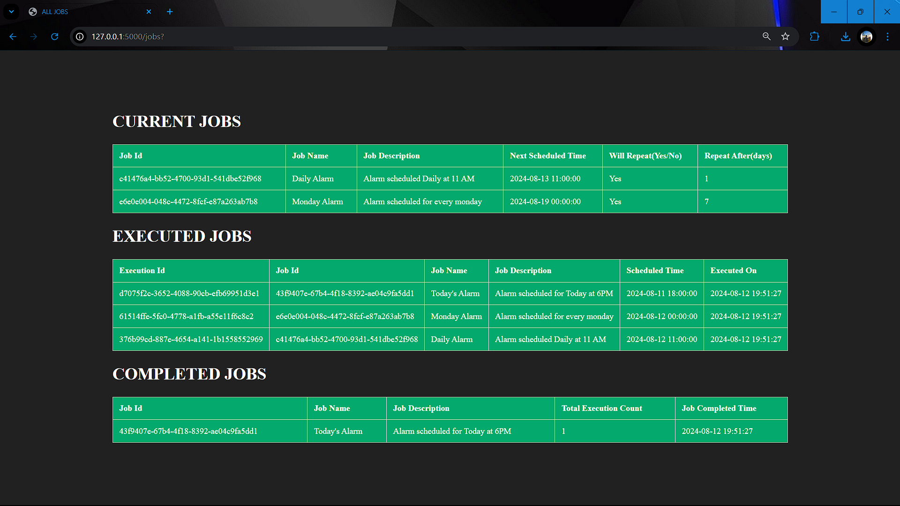

### README File for Digantara Assignment for the role of Python Developer BE

## Overview :

The Application is an implementation of the requirements given in the Assignment.

The Application provides mainly 4 functionalities ->

    1. View all the Jobs and their status.
    2. View the details of a specific Job.
    3. Add/Schedule a new Job.
    4. Execute the jobs(Discussed later).

## Requirements 

The following libraries need to be installed ->

    . flask
    . jinja2

## APIs :

The Application has the following API Routes ->

    1. localhost/
        - Method -> GET
        - Base Route, allows user to navigate to different APIs and pages.
    
    2. localhost/jobs
        - Method -> GET
        - Displays details of all the Jobs and their status.
    
    3. localhost/jobs/<jobId>/<jobType> 
        - Method -> GET
        - Query Params -> 
            . jobId {Job Id of the job to view}
            . jobType {Type of job, like current, or executed or completed}
        - Displays details of a specific Job that user click on.
    
    4. localhost/add_job 
        - Method -> GET
        - Displays a form to enter details for creating a new Job.
    
    5. localhost/add_job
        - Method -> POST
        - Saves the newly created Job Data in the Database.

## Database : 

In order to store the, I have created some Models, which store each job data.

## Database Models : 

    - Job ->
        . jobId = String
        . jobName = String 
        . jobDescription = String
        . repeat = Boolean
        . scheduledTime = String(Datetime)
        . lastRun = String(Datetime)
        . repeatAfter = Integer
        . runTime = Integer
        . isCompleted = Boolean

        . Stores the current scheduled jobs

    - CompletedJob ->
        . jobId = String
        . jobName = String 
        . jobDescription = String
        . repeat = Boolean
        . scheduledTime = String(Datetime)
        . lastRun = String(Datetime)
        . repeatAfter = Integer 
        . runTime = Integer
        . isCompleted = Boolean
        . jobCompletedTime = String(Datetime)

        . Stores the Jobs that are completed

    - ExecutedJob ->
        . executionId = String
        . jobId = String
        . jobName = String
        . jobDescription = String
        . scheduledTime = String(Datetime)
        . executedTime = String(Datetime)

        . Stores the Executed Jobs

    - JobList ->
        . jobsQueue = List (Stores the current scheduled Jobs)
        . completedJobs = List (Stores the Completed Jobs)
        . executedJobs = List (Stores the Executed Jobs)

## Screenshots 

Home - Page

 
 

Show All Jobs - Page (Clicking "Show All Jobs" Button on "Home" - Page)

Show Details of a Specifi Job - Page
(On Clicking one of the rows of the Table present in the "Show All Jobs" - Page)

Add A New Job - Page (Clicking "Add New Job" Button on "Home" - Page)

Show All Jobs - Page (After Clicking the "Execute a Task" Button on "Home" - Page)

## Assumptions and Limitations :

The Application has some limitations ->
    
    1. The Tasks are executed by clicking on the "Execute a Task" Button on the "Home" Screen.
    
    2. The User Can't Delete a Repeated Job, but can create one.
    

Assumptions were made while developing the Application ->

    1. The Data is stored in Lists that are treated as Database.

    2. Only one user is there for the entire Application.

    3. User can only Repeat a job based on the number of days.

## Discussion On Execution of Jobs : 

The Application stores the jobs in a Priority Queue (or Heap), which provides the jobs to be finished in the near time first.

In the Application, I have provided a button to perform the Execution Task. Which Otherwise, will running on a regular basis, (like a Cron job on a server) which executes based on the condition that a job's scheduledTime is passed.

Whenever user clicks the "Execute a Task" button on the "Home" - Page. It works in the same way as a scheduler working on the server will work, but with a little change in database traversal.

The Function goes through the Currently Scheduled jobs checking the condition, if the job's scheduledTime is passed already. Them marks the Job Completed and creates an entry in the executed table, with the executionId.

